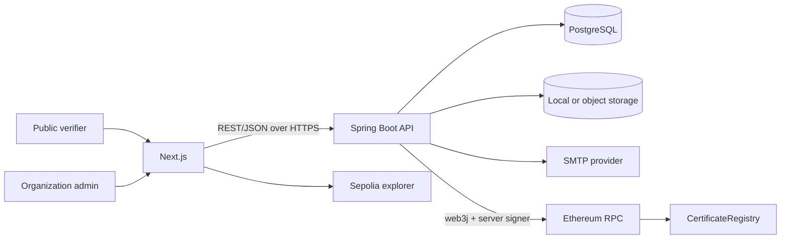

# CertChain System Design

## 1. Scope and architectural decisions

CertChain is a modular monolith with three deployable parts:

- a Next.js web application for the organization portal and public verification pages;
- a Spring Boot REST API that owns authentication, authorization, certificate workflows, persistence, artifact generation, email, and blockchain signing;
- an Ethereum smart contract that stores the minimum immutable proof needed to verify issuance and revocation.

PostgreSQL is the operational source of truth. Ethereum is the immutable proof and revocation layer. PDF files are generated artifacts, not authoritative records.

Two separate state concepts prevent partial failures from being presented as successful certificates:

- `CertificateLifecycle`: `DRAFT`, `ISSUING`, `ISSUED`, `ISSUE_FAILED`.
- Public `CertificateStatus`: derived as `REVOKED`, then `EXPIRED`, then `VALID`; it exists only for an `ISSUED` certificate.

The first release uses one backend-managed Ethereum signer with `ISSUER_ROLE`. Application authorization still isolates every administrator to their organization. Supporting one on-chain wallet per organization can be added later without exposing keys to the browser.

## 2. Final folder structure

```text
CertChain/
├── frontend/
│   ├── src/
│   │   ├── app/
│   │   │   ├── (public)/
│   │   │   │   ├── page.tsx
│   │   │   │   └── verify/
│   │   │   │       ├── page.tsx
│   │   │   │       └── [certificateId]/page.tsx
│   │   │   ├── (auth)/login/page.tsx
│   │   │   └── (portal)/
│   │   │       ├── dashboard/page.tsx
│   │   │       ├── certificates/
│   │   │       │   ├── page.tsx
│   │   │       │   ├── new/page.tsx
│   │   │       │   └── [id]/page.tsx
│   │   │       └── profile/page.tsx
│   │   ├── components/
│   │   │   ├── certificates/
│   │   │   ├── layout/
│   │   │   └── ui/
│   │   ├── lib/
│   │   ├── services/
│   │   └── types/
│   ├── public/
│   ├── package.json
│   └── .env.example
├── backend/
│   ├── src/main/java/com/certchain/
│   │   ├── auth/
│   │   ├── blockchain/
│   │   ├── certificate/
│   │   ├── common/
│   │   │   ├── config/
│   │   │   ├── exception/
│   │   │   └── security/
│   │   ├── organization/
│   │   ├── transaction/
│   │   └── user/
│   ├── src/main/resources/
│   │   ├── db/migration/
│   │   └── application.yml
│   ├── src/test/java/com/certchain/
│   ├── pom.xml
│   └── .env.example
├── blockchain/
│   ├── contracts/CertificateRegistry.sol
│   ├── ignition/modules/CertificateRegistry.ts
│   ├── test/CertificateRegistry.ts
│   ├── hardhat.config.ts
│   ├── package.json
│   └── .env.example
├── docs/
│   ├── api/
│   ├── architecture/
│   ├── blockchain/
│   ├── database/
│   ├── flows/
│   └── screenshots/
├── .env.example
├── .gitignore
├── docker-compose.yml
└── README.md
```

## 3. Component responsibilities



- The frontend renders views, validates for usability, and calls the API. It never decides authorization and never receives signing keys.
- The backend owns canonicalization and hashing. Clients cannot submit an authoritative certificate hash or transaction hash.
- The database stores private and operational data, including recipient email and revocation reason.
- The contract stores only a hashed certificate key, a SHA-256 certificate hash, timestamps, revocation state, and issuer address.
- File storage starts as a configurable local directory for development and is replaceable with object storage through a storage interface.

## 4. Security boundaries

- Public endpoints expose only fields required to verify a certificate. Recipient email, internal IDs, and revocation reason are excluded.
- Organization endpoints require a valid access token and enforce organization ownership in the service/repository query, not only at the controller.
- Passwords use BCrypt. JWT secrets, RPC URLs, SMTP credentials, database credentials, and wallet keys are environment variables.
- CORS is an allowlist. Production uses HTTPS. Error responses do not expose stack traces.
- The signing wallet is server-side and receives only `ISSUER_ROLE`; the deployment/admin wallet should be separate in production.
- Contract calls are idempotent by deterministic `certificateKey`; duplicate issuance reverts.

## 5. Consistency and failure recovery

Issuance crosses PostgreSQL, Ethereum, file storage, and email, so it cannot be one database transaction. CertChain uses a state machine and transaction journal:

1. Lock the draft certificate and change lifecycle from `DRAFT` or retryable `ISSUE_FAILED` to `ISSUING`.
2. Freeze immutable issue fields, build canonical data, and persist its hash.
3. Create a `BlockchainTransaction` row with type `ISSUE` and state `CREATED`.
4. Submit the contract call, then store the transaction hash and state `SUBMITTED` immediately.
5. Wait for a successful receipt and validate the emitted event. On revert or timeout, persist failure information and do not set `ISSUED`.
6. Persist the block metadata, transition the certificate to `ISSUED`, and commit.
7. Generate QR/PDF and store their location. Artifact generation can be retried without another blockchain transaction.
8. Send email after issuance. Email failure is logged and retryable; it does not undo an immutable issuance.

If the process crashes after the chain accepts a transaction but before the database commits, a reconciliation service looks up the known transaction hash or the deterministic certificate key/event and repairs the local state. Retrying never issues a second on-chain record.

Revocation follows the same journal pattern. The database is updated to revoked only after a successful receipt and validated `CertificateRevoked` event.

## 6. Certificate identity and canonical hash

- Public ID format: `CERT-YYYY-NNNNNN`.
- A database-backed yearly sequence allocates numbers safely under concurrency; `COUNT(*) + 1` is forbidden.
- Contract key: `keccak256(UTF-8(uppercase(trim(certificateId))))`.
- Certificate proof: `SHA-256(UTF-8(canonicalData))`, stored as `bytes32`.

Canonical data version 1 uses an explicit field order and escaping rules:

```text
v1|certificateId=<value>|recipientName=<value>|programName=<value>|organizationId=<uuid>|issueDate=<yyyy-MM-dd>|expiryDate=<yyyy-MM-dd-or-empty>
```

Text values are Unicode-normalized with NFC, trimmed, internal whitespace collapsed to a single ASCII space, and reserved characters (`\\`, `|`, `=`) escaped. Certificate IDs are uppercased with `Locale.ROOT`; names and program titles retain case. Dates are ISO-8601 calendar dates. The version prefix allows a future algorithm without silently changing old proofs.

## 7. Verification trust model

The backend loads the certificate from PostgreSQL, rebuilds the canonical representation, recomputes SHA-256, and reads the on-chain record using the deterministic key. Blockchain verification is true only when:

- an on-chain record exists;
- the locally recomputed hash equals the database hash;
- the locally recomputed hash equals the on-chain hash;
- the database and on-chain revocation flags agree.

The response separately reports `blockchainVerified`. Public status is evaluated with revocation priority and the current clock. A database-only record, mismatched hash, failed RPC read, or unconfirmed issuance is never presented as blockchain verified.

