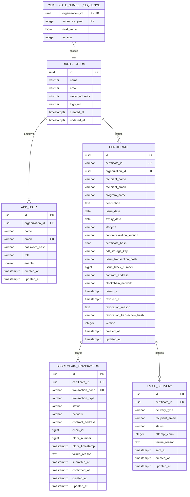

# Database ER Model

## Relationship model

## Backend entities

| Entity | Purpose | Key rules |
|---|---|---|
| `Organization` | Issuing tenant and public issuer profile | Name and email required; wallet address optional in the first backend-signer release. |
| `User` | Authenticated organization administrator | Globally unique normalized email, BCrypt password hash, role enum, organization required. |
| `Certificate` | Operational certificate aggregate | UUID internal ID; unique immutable public ID; immutable proof fields after issuance begins; optimistic locking. |
| `BlockchainTransaction` | Auditable transaction journal | One certificate can have issue/revoke attempts; transaction hash unique when present; status transitions are explicit. |
| `EmailDelivery` | Retry/audit record for recipient notifications | Email failure is independent from issuance success. |
| `CertificateNumberSequence` | Concurrency-safe yearly public ID allocation | Updated under a row lock; unique `(organization_id, sequence_year)`. |

## Enums and derived values

- `UserRole`: `ORG_ADMIN`.
- `CertificateLifecycle`: `DRAFT`, `ISSUING`, `ISSUED`, `ISSUE_FAILED`.
- `CertificateStatus`: `VALID`, `EXPIRED`, `REVOKED` (derived, not persisted).
- `BlockchainTransactionType`: `ISSUE`, `REVOKE`.
- `BlockchainTransactionStatus`: `CREATED`, `SUBMITTED`, `CONFIRMED`, `FAILED`.
- `EmailDeliveryStatus`: `PENDING`, `SENT`, `FAILED`.

The database stores timestamps as UTC `timestamptz`. Issue and expiry are business dates; expiration is evaluated at the end of the expiry date in the configured organization timezone, initially UTC unless the domain later adds an organization timezone.

## Important constraints and indexes

- unique index on `certificate.certificate_id`;
- index on `certificate(organization_id, created_at desc)`;
- index on `certificate(organization_id, lifecycle)`;
- unique partial/index constraint for non-null transaction hashes;
- index on `blockchain_transaction(certificate_id, transaction_type, created_at desc)`;
- check constraint: `expiry_date is null or expiry_date >= issue_date`;
- check constraints for 64-character lowercase hexadecimal hashes and Ethereum address/transaction lengths where practical;
- foreign keys use restrictive deletion for certificates and transaction history. Issued records are never cascade-deleted.

