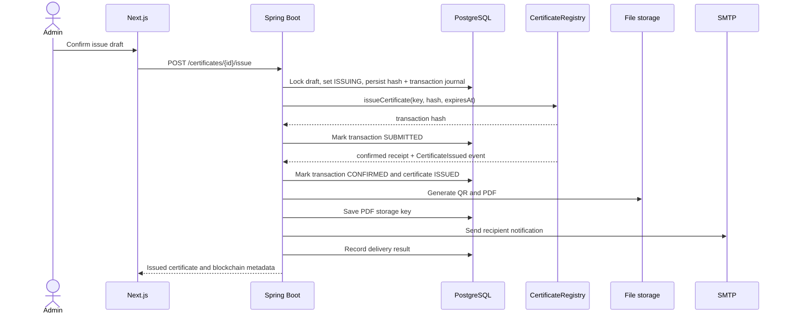
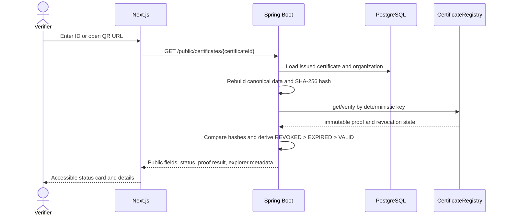
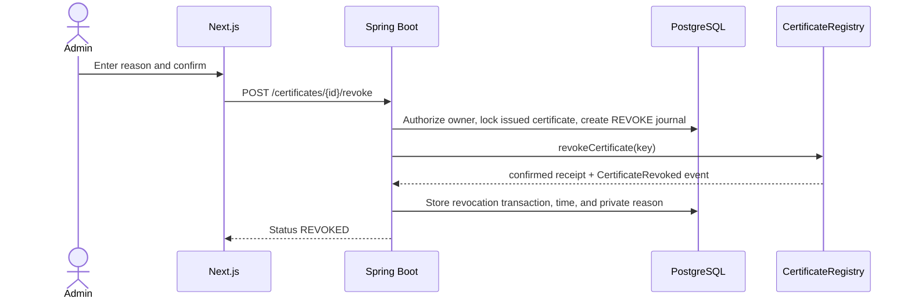

# Certificate Workflows

## Issuance

Failure behavior:

- Validation or authorization failure stops before any chain call.
- A reverted or failed receipt sets the transaction to `FAILED` and certificate to `ISSUE_FAILED`; it is not public.
- A timeout remains `SUBMITTED`/`ISSUING` until reconciliation determines the receipt outcome.
- PDF failure leaves the immutable issuance intact and schedules artifact retry.
- Email failure leaves issuance intact and records a retryable delivery failure.

## Public verification

The QR contains only `https://<frontend>/verify/<certificateId>`. An unavailable RPC produces a clear verification-unavailable state, not a false valid result.

## Revocation

