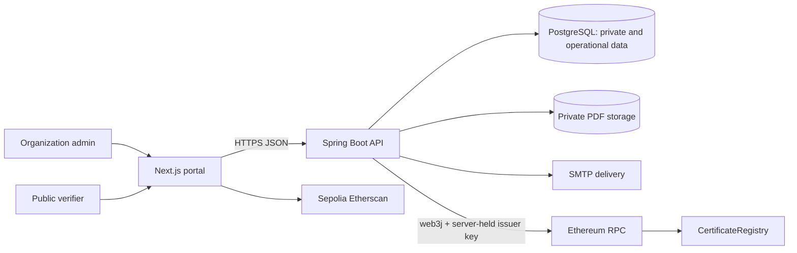
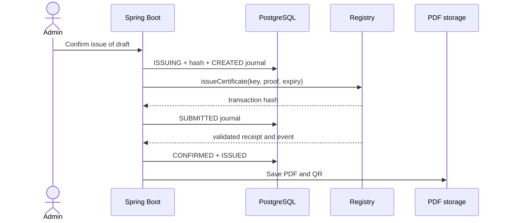
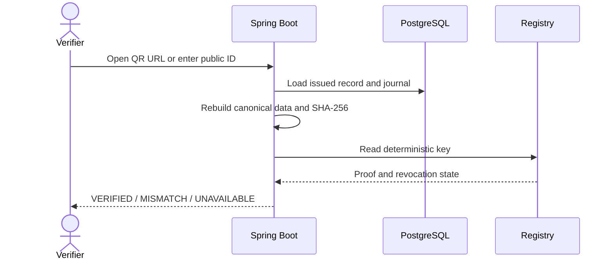
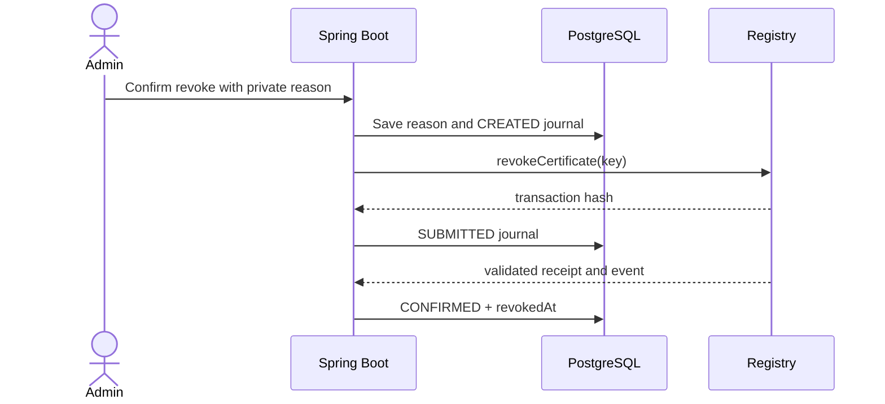
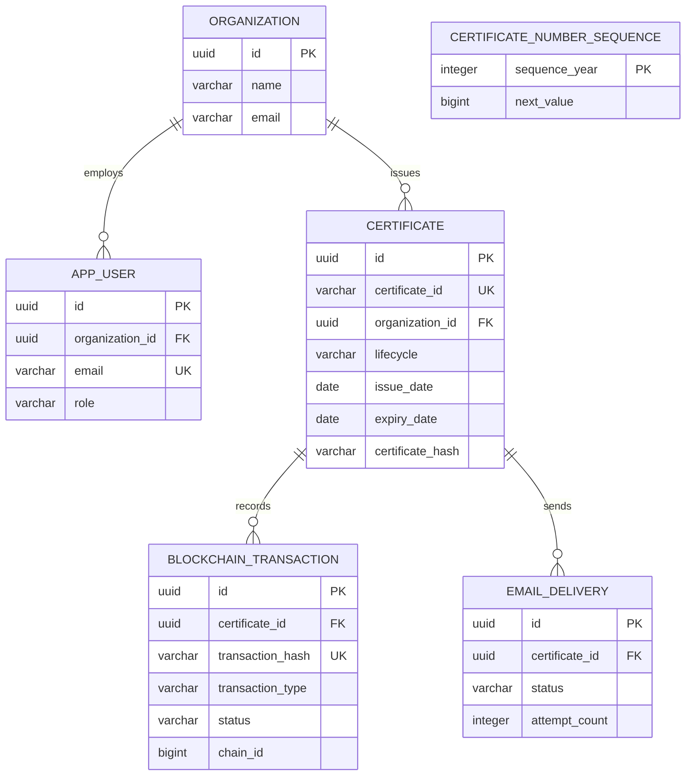
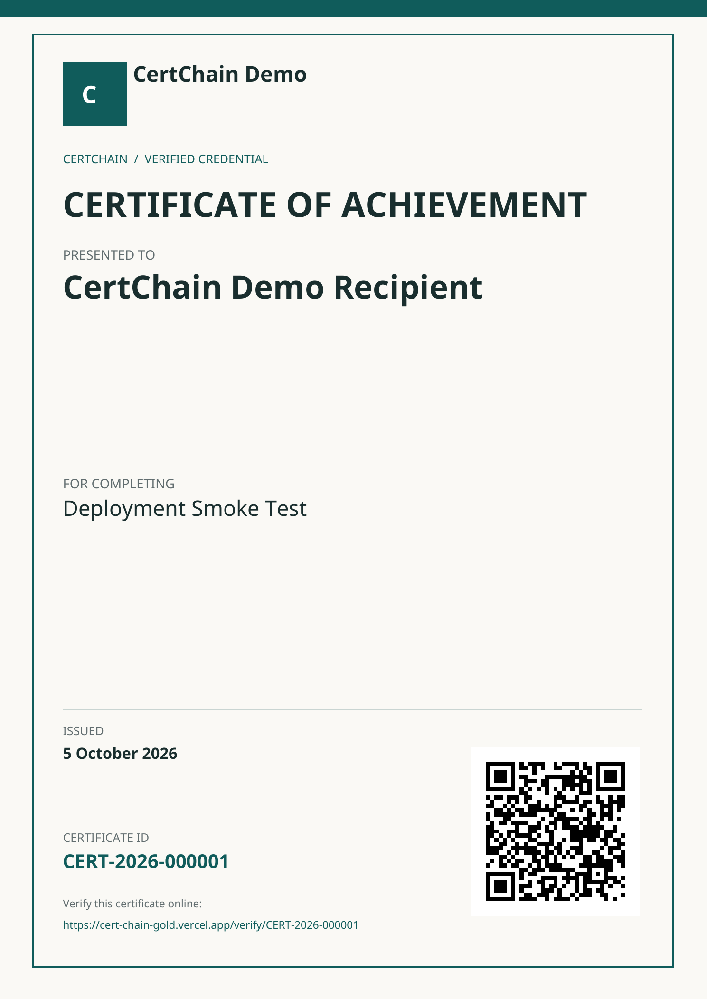
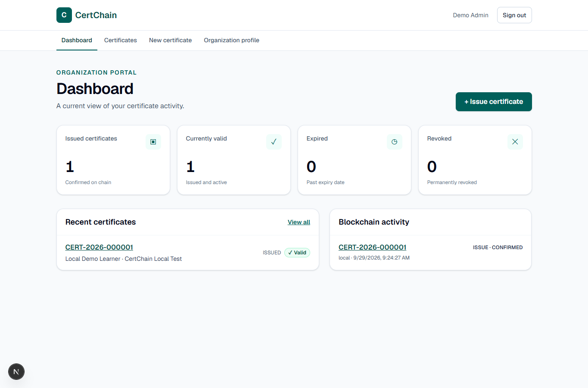
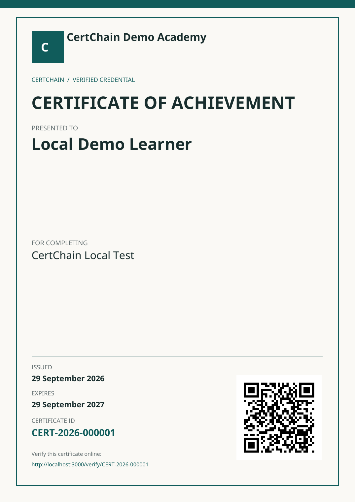

**CertChain - Assignment Report (evidence draft)**
Prepared 6 October 2026 against source commit `f196d2aa5c5fb13e2c97609bf9464383bceb0620`, with the documentation updates in this package. This remains a draft because the public demo video, live email, hosted expiry evidence, and complete screenshot set are pending. Local screenshots use synthetic data and a Hardhat chain. Hosted screenshots and explorer links are identified separately below. Only free-tier services are used.

## 1. System Overview

CertChain lets an educational organization create and manage digital certificates while a public visitor checks whether an issued certificate has a matching blockchain proof. An organization administrator signs in, creates a draft, confirms issuance, downloads the generated PDF, and can later revoke the certificate with a private reason. A recipient or verifier opens the QR link or enters `CERT-YYYY-NNNNNN` on the public page.

The design separates three kinds of information. PostgreSQL is the operational database for organizations, users, certificate details, recipient email, transaction and delivery journals, and private revocation reasons. Private file or object storage holds generated PDFs. Ethereum stores only a deterministic certificate key, a `bytes32` SHA-256 proof, issue and optional expiry timestamps, issuer address, and a one-way revocation flag. The chain does not contain names, emails, PDF bytes, or the revocation reason.

The implemented system runs locally with PostgreSQL and Hardhat. A free-tier deployment uses Vercel Hobby, Render Free, Neon Free PostgreSQL and private storage, and a source-verified contract on Sepolia. One hosted certificate remains valid, and a second was issued then revoked; both public results matched their confirmed Sepolia proof. Live email, hosted expiry evidence, and the public video remain pending; the deployment record is included in this package.

## 2. System Architecture

The repository has a Next.js/React frontend, a Java 21 Spring Boot 4.1.1 backend, a PostgreSQL database with Flyway migrations, and a Solidity `CertificateRegistry` contract. The frontend renders the portal and public verification pages. The backend owns authentication, tenant authorization, canonicalization, signing, transaction recovery, PDF generation, and email delivery. It accesses the chain through web3j and a server-side issuer wallet.

The frontend can suggest valid inputs and guard navigation, but the backend authorizes every protected route using the verified JWT's organization ID. The portal never sends an authoritative hash, status, transaction hash, role, or issuer private key.

## 3. User Flow / System Flow

**Issuance.** An admin creates a tenant-owned draft. The server allocates the public ID with a PostgreSQL global yearly sequence. On confirmation, the backend locks the record, freezes proof-relevant fields, computes the canonical SHA-256 hash, and commits a `CREATED` blockchain journal before sending a transaction. It stores the returned hash as `SUBMITTED`, then marks the certificate `ISSUED` only after validating the receipt, confirmations, expected contract, issuer, event, and on-chain record. A timeout stays pending for reconciliation; a failed receipt cannot become issued. PDF generation and email run afterward and can be retried without another chain issue call.

**Verification.** The public route accepts only a strict public ID and exposes issued certificates. The backend rebuilds the canonical string, recomputes SHA-256, compares it with the stored hash and chain proof, checks the expected network/contract and revocation consistency, then derives status. Unknown, malformed, and draft IDs share a not-found response. An RPC outage or proof mismatch does not produce a false verified or valid result.

**Revocation.** The admin enters a private reason and explicitly confirms. The backend journals `CREATED` and `SUBMITTED`, validates a `CertificateRevoked` receipt/event, and only then sets `revokedAt`. A timeout stays pending for recovery, and an uncertain transaction is not blindly resent. Public status gives `REVOKED` priority over `EXPIRED`; expiration is derived at read time after the UTC expiry date.

## 4. Database Design / ER Diagram

Flyway migrations create normalized tables for `organization`, `app_user`, `certificate`, `blockchain_transaction`, `email_delivery`, and `certificate_number_sequence`. A certificate belongs to one organization, has zero or more transaction and email journal rows, and retains its own immutable public ID. Transaction hash, chain ID, network, contract, block, confirmation, and failure details live in `blockchain_transaction`, not duplicated on `certificate`. Public `VALID`/`EXPIRED`/`REVOKED` status is computed, not persisted.

UUIDs are internal keys; `certificate_id` is unique and formatted `CERT-YYYY-NNNNNN`. The global yearly sequence uses one atomic PostgreSQL upsert per allocation, allows gaps after rollback, and rejects exhaustion after `999999`. The database also enforces case-insensitive unique user emails, nonnegative journal values, valid enum strings, transaction-hash uniqueness, and `expiry_date >= issue_date` when expiry exists. Foreign keys restrict deletion of issued history.

## 5. Blockchain Architecture

The backend computes `certificateKey = keccak256(UTF-8(uppercase(trim(public ID))))`, which gives a stable lookup key. Anyone who knows or guesses the public ID can compute this key; hashing does not make the ID confidential. The proof is `SHA-256(UTF-8(canonical data))`. Version `v1` fixes the field order: public ID, recipient name, program, organization UUID, issue date, expiry date. Text is Unicode NFC normalized, trimmed, internal whitespace collapsed, and backslash/pipe/equals escaped. The ID is uppercased with `Locale.ROOT`; names and programs keep their case. Dates use ISO format and a missing expiry is empty. This prevents logically equivalent text from producing accidental different proofs.

The backend signs transactions with a server-held issuer key stored in Render's secret environment; the user browser never gets this key. A separate admin wallet controls contract roles. The [Sepolia registry](https://sepolia.etherscan.io/address/0x293597447c1e39825Df82fc3791BA7AB3Eb9719f#code) is source-verified. [Hosted issuance `0x3e690ae4…19c6690`](https://sepolia.etherscan.io/tx/0x3e690ae42fda4f90066c922bc3310e4b2384160cd47c98645fdb1f15819c6690) succeeded in block `11852629` with a decoded `CertificateIssued` event. A separate [hosted revocation `0x180f2dad…f856e028`](https://sepolia.etherscan.io/tx/0x180f2dadcb0e2ba8a1644b34036a805faebfce4d9dd89b33f5978f69f856e028) succeeded in block `11852907` with a decoded `CertificateRevoked` event. Transaction journals preserve `CREATED`, `SUBMITTED`, `CONFIRMED`, and `FAILED` states across process failures. Reconciliation checks a known hash or on-chain event/key before a retry, avoiding duplicate issuance or revocation.

## 6. Smart Contract Design

`CertificateRegistry.sol` uses OpenZeppelin `AccessControlDefaultAdminRules` with an explicit admin, a one-day delayed admin transfer, and `ISSUER_ROLE` for issue and revoke. The constructor rejects zero addresses. Issuance rejects zero key/hash, duplicates, and expiry at or before the block time. Records are never overwritten. Revocation rejects missing or already revoked keys. Indexed `CertificateIssued` and `CertificateRevoked` events support receipt validation and recovery. Public read and verify functions return deterministic results; on-chain expiry is true only after `expiresAt`, and application status prioritizes revocation.

The contract stores only key, proof hash, issue/expiry timestamps, issuer, and revoked flag. Eight contract tests passed locally on 6 October; coverage reported 100% line and statement coverage for `CertificateRegistry.sol`. Etherscan displays an Exact Match source verification for the deployed Sepolia address.

## 7. User Interface Design / Screenshots

The portal uses a restrained educational trust style with clear labels, focus states, loading/empty/error states, and text/icon status cues. The screenshots below are actual browser or PDF renders. Local verification states came from a synthetic PostgreSQL and Hardhat demonstration; hosted captures use the real Vercel/Sepolia deployment.

The local screenshots and PDF are synthetic captures from separate runs; repeated public IDs do not represent one certificate history. The local QR decoded to its localhost URL. The hosted PDF is included in this package; it was downloaded, visually checked, and its QR decoded exactly to the public URL for `CERT-2026-000001`. The separate hosted [revoked result](https://cert-chain-gold.vercel.app/verify/CERT-2026-000002) and [explorer event](https://sepolia.etherscan.io/tx/0x180f2dadcb0e2ba8a1644b34036a805faebfce4d9dd89b33f5978f69f856e028#eventlog) were verified on 6 October. A third [hosted fixture](https://cert-chain-gold.vercel.app/verify/CERT-2026-000003) expires after 6 October UTC and was still VALID that day; its actual EXPIRED result needs a next-day check. Saved hosted revoked/expired screenshots and real recipient email remain pending. Local chain hashes are not Sepolia proof.

## 8. Implementation Summary

Implemented features include authentication with BCrypt and short-lived JWT cookies, CSRF protection, tenant-safe draft management, deterministic proof hashing, a role-controlled registry, failure-safe issuance/revocation journals, public verification, PDF/QR generation, bounded email delivery, and a tenant dashboard. The backend stores authoritative chain metadata in transaction rows; PDF and email failures do not undo confirmed issuance. The hosted backend uses Neon PostgreSQL and private object storage. One confirmed Sepolia issuance remains valid, and another was successfully revoked with public proof. Live SMTP remains disabled pending Brevo phone verification and a real mailbox test.

On 6 October 2026, Docker was restored and two full backend runs each passed 73 tests with zero failures, errors, or skips, including PostgreSQL Testcontainers migration, constraints, security, tenant, workflow, and delivery tests. An additional Mailpit smoke test passed with a synthetic multipart email and PDF attachment. Frontend lint/build and all 31 tests passed. Contract typecheck, all eight tests, and coverage passed; `CertificateRegistry.sol` reported 100% line and statement coverage. The included dated validation record distinguishes these local results from hosted proof. The hosted PDF was inspected and its QR independently decoded. Hosted revocation and public re-verification passed. A complete hosted browser walkthrough, real mailbox delivery, the expiry fixture's next-day result, and backup/recovery check remain open.

## 9. Public GitHub Repository Link

[https://github.com/Thna17/CertChain](https://github.com/Thna17/CertChain) is the original public team repository; the free deployment currently builds from [https://github.com/Seypa-47/CertChain](https://github.com/Seypa-47/CertChain). The [public app](https://cert-chain-gold.vercel.app), [API health endpoint](https://certchain-api-06gv.onrender.com/actuator/health), [verified contract](https://sepolia.etherscan.io/address/0x293597447c1e39825Df82fc3791BA7AB3Eb9719f#code), and [hosted issuance transaction](https://sepolia.etherscan.io/tx/0x3e690ae42fda4f90066c922bc3310e4b2384160cd47c98645fdb1f15819c6690) are public. Their current availability must be checked again before submission.

## 10. Individual Contribution Report

Git history through `f196d2a` contains exactly two author identities. **Hong Than Brathna** (`hangbrathna10@gmail.com`) authored foundation commit `8b67919` on 22 September 2026. That commit established the repository, Next.js/Spring Boot/Hardhat scaffolds, Maven wrapper, Docker Compose, environment templates, initial interface and security skeleton, and first architecture, API, database, flow, blockchain, and checklist documents.

At the report evidence cutoff, **Seypa47** (`khemrakpasey01@gmail.com`) authored 22 subsequent commits through `f196d2a`. Their diffs added the database/domain layer, PostgreSQL tests, authentication, draft management, registry contract, hashing and blockchain workflows, verification, PDF/QR, revocation, email, dashboard, security tests, deployment preparation, free hosting integration, and report work. These statements describe Git-authored changes, not a measured percentage of effort. The distribution is visibly uneven: one foundation commit and 22 later commits. No PR, review, design-session, pair-programming, or separate test-session record was supplied. Commit count alone cannot establish a fair effort split. Only Git history is used for attribution, as requested; later submission-preparation commits are outside this dated tally.

## 11. Public Demo Video Link

**Pending.** The student plans to film the demo and has not provided a public URL. An ordered narration and recording checklist are included in this package. The report must be finalized only after a real URL is available and checked. The video should show the hosted Sepolia evidence and clearly label any local synthetic tamper or expiry fixture.
